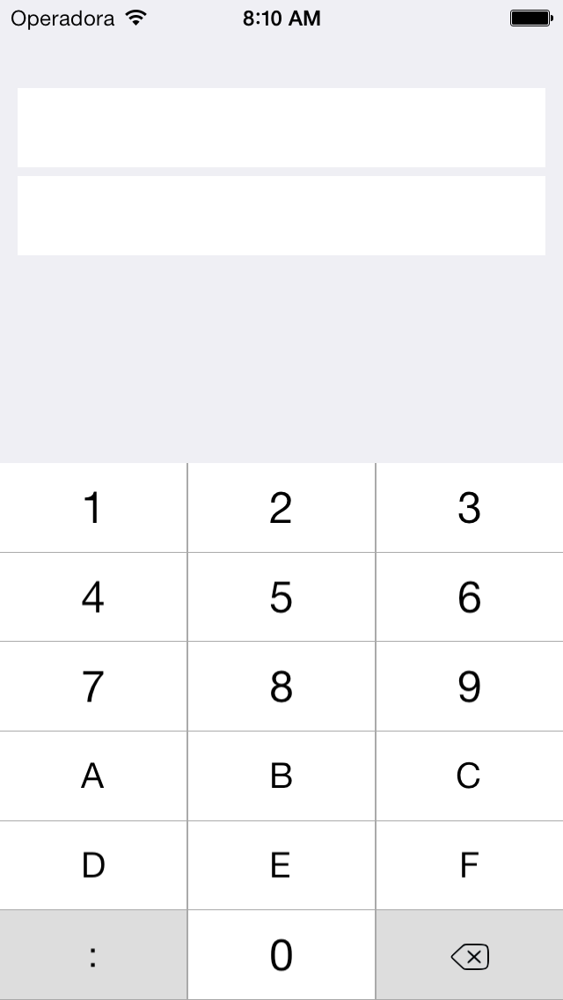
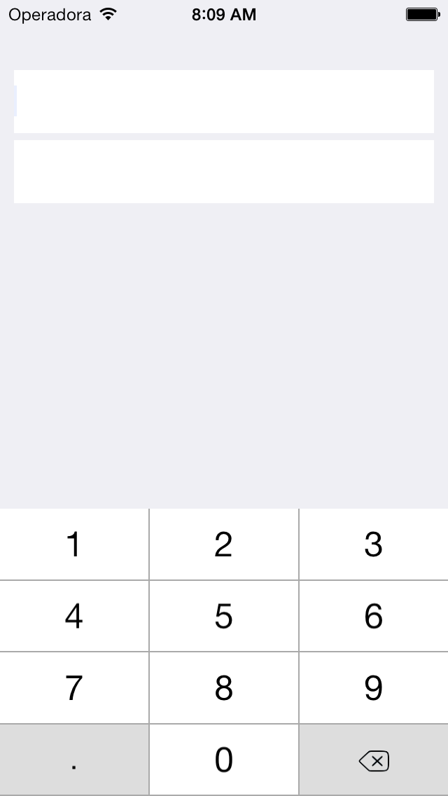

#motion-ipkeyboard

A simple custom keyboard meant for typing ip addresses.

## Installing

### With Bundler

1. Add motion-ipkeyboard gem to your Gemfile
```ruby
gem 'motion-ipkeyboard'
```

2. ```$ bundle install```

### Without Bundler

  1. install the motion-ipkeyboard gem
    ```$ gem install motion-ipkeyboard```
  2. add to your RubyMotion app Rakefile:

    ```ruby
    require 'rubygems'
    require 'motion-ipkeyboard'
    ```

## Usage

```ruby
    # IPv6 keyboard
    ipv6_input_field = UITextField.alloc.initWithFrame(CGRectMake(10, 100, 300, 45))
    ipv6_input_field.setBackgroundColor(UIColor.whiteColor)
    ipv6_input_field.inputView = RMIPKeyboard::Keyboard.alloc.initWithTextFieldAndLayout(ipv6_input_field,"ipv6")
    ipv6_input_field.setDelegate(self)
    self.view.addSubview(ipv6_input_field)

    # IPv4 keyboard
    ipv4_input_field = UITextField.alloc.initWithFrame(CGRectMake(10, 50, 300, 45))
    ipv4_input_field.setBackgroundColor(UIColor.whiteColor)
    ipv4_input_field.inputView = RMIPKeyboard::Keyboard.alloc.initWithTextFieldAndLayout(ipv4_input_field,"ipv4")
    ipv4_input_field.setDelegate(self)
    self.view.addSubview(ipv4_input_field)
```

## Screenshots

|IPv6|IPv4|
|---|---|
|||

## Thanks

The keyboard implementation is basicaly a translation of [doofyus/HexKeyboard](https://github.com/doofyus/HexKeyboard) to RubyMotion.